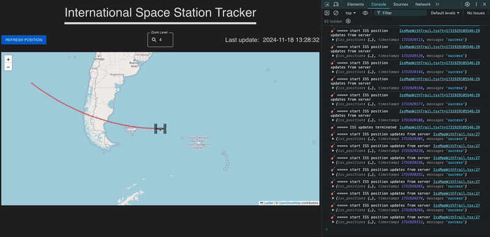

# ISS Tracker

A real-time International Space Station tracking application that shows the current location of the ISS on a world map.

## Installation

1. Clone the repository
2. Run `npm install`
3. Run `npm run server`
4. Run `npm run client`
5. Open `http://localhost:5173` in your browser

## Communication

1. via restful API  
   The restful API implemented just for testing purposes.  
   The web app is using the websocket to get the ISS position.
   for live tracking we can also use polling technique to get the ISS position.
   The following endpoints are available:
   - http://localhost:3000/health - get the health status of the server
   - http://localhost:3000/api/iss/position - get the current position of the ISS
2. via websocket (socket.io)
   - ws://localhost:3000
  
> Note: The implementation of the websocket was made just for fun (🧂🎸).  
> The real-time tracking of the ISS is came from the API provided by the [open-notify.org](http://api.open-notify.org/iss-now.json)  
> So it can be done at the client side without the need of the server and check the API every X seconds.  
> Or make the API call from the server and use the local server to check with the API.  

### Client implementation
I used React, TypeScript, and Vite to create the client side of the application.  
The client side is using the [react-leaflet](https://react-leaflet.js.org/) and [leaflet](https://leafletjs.com/) to show the map.  
The client side is using the [socket.io-client](https://socket.io/docs/v4/client-api/) to connect to the server and get the ISS position. (again, just for fun 🧂🎸)  

### Configurations
The server and the client are using the `.env` file to get the configuration.  
Available configurations:  
| Name | Description | Default |
|------|-------------|---------|
| `PORT` | The port of the server | 3000 |
| `ISS_USE_API` | default is `true`, if `false` the serve will use some mock data | true |

see `packages/server/config/index.ts` for more details.  

## Demo ISS Tracker

